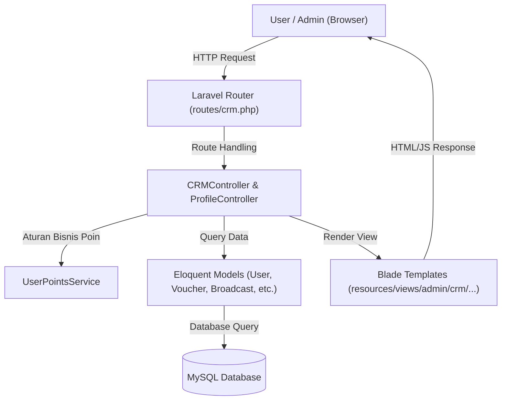
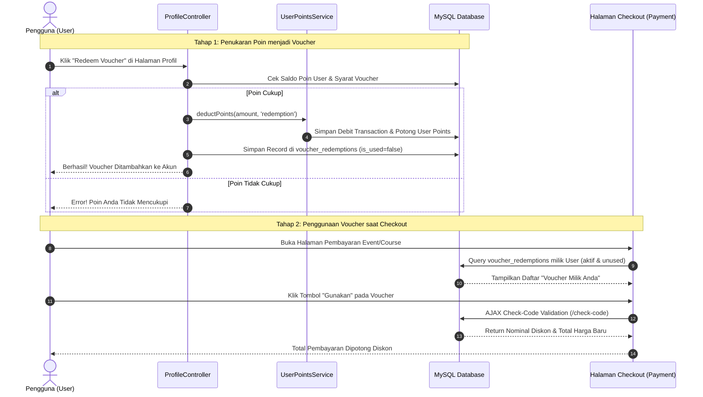

# 📚 DOKUMENTASI LENGKAP ARSITEKTUR & ARUS KODINGAN SISTEM CRM (LMS-IDSPORA)

Dokumen ini berisi panduan teknis komprehensif mengenai **Sistem Customer Relationship Management (CRM)** pada project ini, mencakup arsitektur MVC, skema database, peta lokasi file codingan, serta alur kerja rinci untuk setiap fitur CRM.

---

## 📑 DAFTAR ISI
1. [Arsitektur Umum & Pola Design MVC](#1-arsitektur-umum--pola-design-mvc)
2. [Peta Lokasi File Codingan (Directory Structure)](#2-peta-lokasi-file-codingan-directory-structure)
3. [Skema Database & Tabel Terkait (Database Layer)](#3-skema-database--tabel-terkait-database-layer)
4. [Detail Alur & Modul CRM](#4-detail-alur--modul-crm)
   - [A. Manajemen Pelanggan, Gamifikasi Poin & Badge](#a-manajemen-pelanggan-gamifikasi-poin--badge)
   - [B. Manajemen Katalog & Penukaran Voucher (Redeem & Checkout Flow)](#b-manajemen-katalog--penukaran-voucher-redeem--checkout-flow)
   - [C. Broadcast & Kampanye Pesan Massal (Blast)](#c-broadcast--kampanye-pesan-massal-blast)
   - [D. Layanan Pelanggan & Tiket Bantuan (Support Messages / Helpdesk)](#d-layanan-pelanggan--tiket-bantuan-support-messages--helpdesk)
   - [E. Feedback Analysis & Kepuasan Pelanggan](#e-feedback-analysis--kepuasan-pelanggan)
5. [Diagram Alur Data (Mermaid Workflow)](#5-diagram-alur-data-mermaid-workflow)

---

## 🏗️ 1. ARSITEKTUR UMUM & POLA DESIGN MVC

Sistem CRM pada platform ini menggunakan pendekatan **Model-View-Controller (MVC)** terintegrasi yang didukung oleh **Service Layer Pattern** untuk menangani kalkulasi kompleks gamifikasi poin.

---

## 📁 2. PETA LOKASI FILE CODINGAN (DIRECTORY STRUCTURE)

Berikut adalah daftar file kunci yang membangun seluruh fitur CRM:

### 🛠️ Routing
- **[routes/crm.php](file:///d:/Magang/LMS%20IdSPora/LMS-idSpora/routes/crm.php)**: Mengatur seluruh endpoint grup `admin/crm` (`dashboard`, `customers`, `vouchers`, `broadcast`, `support`, `feedback`, `certificates`).
- **[routes/web_manual_payment.php](file:///d:/Magang/LMS%20IdSPora/LMS-idSpora/routes/web_manual_payment.php)**: Mengatur endpoint AJAX validasi voucher & referral (`/payment/{event}/check-code` dan `/courses/{course}/check-code`).

### 🎮 Controllers (Logical Layer)
- **[app/Http/Controllers/CRM/CRMController.php](file:///d:/Magang/LMS%20IdSPora/LMS-idSpora/app/Http/Controllers/CRM/CRMController.php)**: Controller utama pengelola Dashboard, Pelanggan, Master Voucher, Broadcast, Support, dan Feedback.
- **[app/Http/Controllers/CRM/CertificateController.php](file:///d:/Magang/LMS%20IdSPora/LMS-idSpora/app/Http/Controllers/CRM/CertificateController.php)**: Controller pengelola templat & penerbitan sertifikat massal.
- **[app/Http/Controllers/User/ProfileController.php](file:///d:/Magang/LMS%20IdSPora/LMS-idSpora/app/Http/Controllers/User/ProfileController.php)**: Mengelola penukaran poin user menjadi voucher di halaman profil (`redeemVoucher`).

### ⚙️ Services & Mailables
- **[app/Services/UserPointsService.php](file:///d:/Magang/LMS%20IdSPora/LMS-idSpora/app/Services/UserPointsService.php)**: Service terpusat untuk logika perhitungan badge, jurnal transaksi poin, penyesuaian manual admin, dan klaim hadiah.
- **`app/Mail/CRMBlastMail.php`**: Class Mailable untuk pengiriman email broadcast massal.

### 🎨 Views (Presentation Layer)
- **Layout**: `resources/views/layouts/crm.blade.php`
- **Dashboard**: `resources/views/admin/crm/dashboard.blade.php`
- **Pelanggan**: `resources/views/admin/crm/customers/index.blade.php` & `show.blade.php`
- **Voucher**: `resources/views/admin/crm/vouchers/index.blade.php`, `create.blade.php`, `edit.blade.php`
- **Broadcast**: `resources/views/admin/crm/broadcasts/index.blade.php` & `create.blade.php`
- **Support Messages**: `resources/views/admin/crm/support/index.blade.php`
- **Feedback Analysis**: `resources/views/admin/crm/feedback/index.blade.php`
- **Checkout Transaksi**: `resources/views/user/payment.blade.php` & `resources/views/course/payment-course.blade.php`

---

## 🗄️ 3. SKEMA DATABASE & TABEL TERKAIT (DATABASE LAYER)

Sistem CRM mengelola dan membaca data dari tabel-tabel utama berikut:

### 1. Tabel `users`
Menyimpan profil akun pengguna beserta saldo gamifikasi.
- `id`: Primary Key.
- `points`: Integer, menyimpan saldo poin terkini milik pengguna.
- `badge`: Enum/String (`beginner`, `explorer`, `learner`, `expert`, `master`).
- `user_status`: Status keaktifan akun.

### 2. Tabel `point_transactions`
Menjadi buku besar (*ledger*) transaksi poin pengguna.
- `user_id`: Foreign key ke `users.id`.
- `amount`: Jumlah poin yang didapat atau dipotong.
- `type`: `credit` (tambah) atau `debit` (kurang).
- `source`: Sumber transaksi (`event_registration`, `course_completion`, `feedback`, `manual`, `redemption`).
- `source_id`: ID referensi dari sumber kegiatan.
- `description`: Catatan rinci asal-usul transaksi poin.

### 3. Tabel `vouchers`
Menyimpan katalog master voucher belanja/potongan harga.
- `code`: Kode unik voucher (misal: `DISCOUNT10K`).
- `name`: Nama promo/voucher.
- `points_required`: Jumlah poin yang harus ditukarkan user untuk mendapat voucher ini.
- `discount_type`: `percentage` (persentase) atau `fixed` (nominal rupiah).
- `discount_value`: Nilai diskon (misal: `10` untuk 10% atau `10000` untuk Rp10.000).
- `min_purchase`: Minimal total transaksi agar voucher dapat digunakan.
- `expires_at`: Tanggal masa berlaku voucher.
- `active`: Boolean (`true`/`false`).

### 4. Tabel `voucher_redemptions`
Menyimpan klaim voucher milik pengguna yang sudah ditukarkan dari poin.
- `user_id`: Foreign key pengguna pemilik voucher.
- `voucher_id`: Foreign key ke `vouchers.id`.
- `code`: Kode unik klaim (dapat menggunakan kode master atau kode acak per pengguna).
- `is_used`: Boolean (`true` jika sudah dipakai belanja, `false` jika belum).
- `used_at`: Timestamp saat voucher dipakai checkout.
- `expires_at`: Tanggal kedaluwarsa voucher pengguna.

### 5. Tabel `broadcasts`
Menyimpan log riwayat pengiriman pesan massal (*campaign blast*).
- `title`: Judul pesan/kampanye.
- `message`: Isi pesan.
- `target_role`: Target penerima (`all`, `user`, `reseller`, `trainer`).
- `channels`: Saluran pengiriman (`email`, `notification`, atau keduanya).
- `total_sent`: Jumlah penerima yang berhasil terkirim.

### 6. Tabel `support_messages`
Menyimpan tiket pertanyaan dan pesan bantuan pelanggan (*helpdesk*).
- `user_id`: Foreign key pengirim pesan.
- `subject`: Topik / Judul masalah.
- `message`: Isi pesan pengguna.
- `status`: Status penanganan (`new`, `in_progress`, `resolved`).
- `reply`: Tanggapan / jawaban dari admin CRM.

---

## 🔄 4. DETAIL ALUR & MODUL CRM

### A. Manajemen Pelanggan, Gamifikasi Poin & Badge
1. **Perolehan Poin Otomatis**:
   - Pendaftaran Event $\rightarrow$ `UserPointsService::addEventPoints()` (+10 s/d +30 PTS).
   - Penyelesaian Course $\rightarrow$ `UserPointsService::addCoursePoints()` (+10 s/d +40 PTS).
   - Pengisian Feedback $\rightarrow$ `UserPointsService::addFeedbackPoints()` (+5 PTS).
2. **Penyesuaian Poin Manual oleh Admin**:
   - Admin membuka rincian pelanggan (`/admin/crm/customers/{customer}`).
   - Admin mengisi modal penyesuaian poin $\rightarrow$ memanggil `CRMController::adjustPoints()`.
   - Controller memanggil `UserPointsService::adjustPointsManual()`, yang mencatat record `credit`/`debit` di `point_transactions` dan memperbarui `users.points` serta `users.badge`.

---

### B. Manajemen Katalog & Penukaran Voucher (Redeem & Checkout Flow)

#### 🛍️ 1. Alur Penukaran Voucher oleh Pengguna (Redeem Flow)
- **Langkah 1**: Pengguna membuka halaman Profil (`/profile`).
- **Langkah 2**: Pengguna memilih voucher dari daftar katalog master (`vouchers` table) dan mengklik tombol **Redeem**.
- **Langkah 3**: Request dikirim ke `ProfileController::redeemVoucher()`.
- **Langkah 4**: Sistem memeriksa apakah `users.points >= vouchers.points_required`.
- **Langkah 5**: Jika cukup, poin dipotong melalui `UserPointsService::deductPoints()` (mencatat transaksi `debit` dengan source `redemption`).
- **Langkah 6**: Sistem membuat record baru di tabel `voucher_redemptions` dengan `is_used = false`.

#### 💳 2. Alur Penggunaan Voucher saat Transaksi (Checkout Flow)
- **Langkah 1**: Pengguna masuk ke halaman pembayaran Event (`user/payment.blade.php`) atau Course (`course/payment-course.blade.php`).
- **Langkah 2**: Sistem secara otomatis membaca data `VoucherRedemption` aktif milik pengguna yang sedang login (`is_used = false` dan belum expired).
- **Langkah 3**: Kotak khusus **"Voucher Milik Anda (Siap Digunakan)"** secara otomatis muncul menampilkan daftar voucher pengguna.
- **Langkah 4**: Pengguna mengklik tombol **"Gunakan"** pada salah satu voucher.
- **Langkah 5**: JavaScript memasukkan kode voucher ke elemen `#promoCodeInput` dan memicu klik tombol `#checkPromoBtn` secara otomatis.
- **Langkah 6**: Request AJAX dikirim ke endpoint `/payment/{event}/check-code` atau `/courses/{course}/check-code`.
- **Langkah 7**: Server memverifikasi kecukupan `min_purchase` dan mengembalikan nilai diskon. Total harga di halaman checkout langsung ter-update.

---

### C. Broadcast & Kampanye Pesan Massal (Blast)
1. Admin membuka menu Broadcast (`/admin/crm/broadcast`).
2. Admin mengklik **Buat Broadcast Baru** (`/admin/crm/broadcast/create`).
3. Admin mengisi Judul, Pesan, Target Role (`user`/`reseller`/`trainer`), dan Saluran (*Email / Notification*).
4. Saat memilih target, JavaScript mengirim request AJAX ke `CRMController::estimateCount()` untuk menampilkan estimasi jumlah pengguna yang akan menerima pesan.
5. Saat formulir dikirim (`CRMController::broadcastSend()`), sistem:
   - Menyimpan log kampanye di tabel `broadcasts`.
   - Mengiterasi seluruh pengguna target.
   - Mengirimkan email massal melalui `Mail::to($u->email)->queue(new CRMBlastMail(...))`.
   - Membuat notifikasi internal di tabel `user_notifications`.

---

### D. Layanan Pelanggan & Tiket Bantuan (Support Messages / Helpdesk)
1. Pengguna mengirimkan tiket bantuan atau kendala melalui formulir kontak platform.
2. Data tersimpan di tabel `support_messages` dengan status default `new`.
3. Admin CRM memantau tiket masuk di `/admin/crm/support`.
4. Admin dapat memperbarui status tiket (`in_progress` / `resolved`) serta memberikan tanggapan balasan melalui `CRMController::updateSupportStatus()`.

---

### E. Feedback Analysis & Kepuasan Pelanggan
1. Setiap ulasan bintang dan saran yang diberikan pengguna pada Event (`feedbacks` table) maupun Course (`reviews` table) dikumpulkan oleh sistem.
2. Pada menu `/admin/crm/feedback`, `CRMController::feedbackAnalysis()` menghitung:
   - Rata-rata rating keseluruhan.
   - Grafik distribusi bintang (Bintang 1 s/d 5).
   - Tren sentimen kepuasan pelanggan untuk evaluasi produk LMS.

---

## 📊 5. DIAGRAM ALUR DATA (MERMAID WORKFLOW)

### Alur Penukaran & Penggunaan Voucher:

---
*Dokumentasi ini dibuat secara otomatis untuk sistem LMS-idSpora.*
