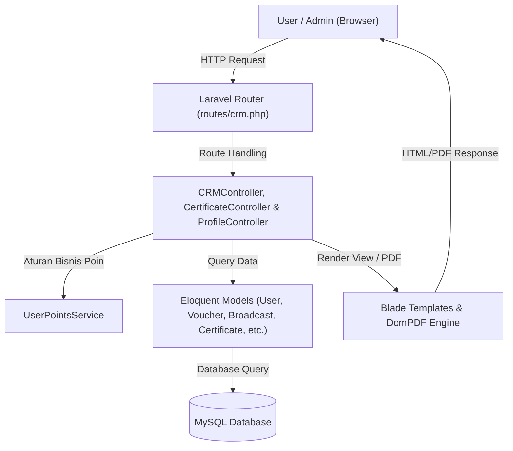
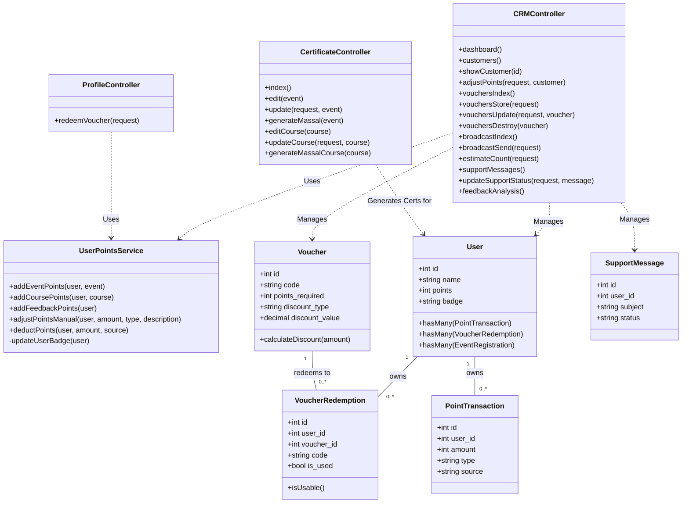

# 📚 DOKUMENTASI LENGKAP ARSITEKTUR, FITUR SERTIFIKAT, CLASS DIAGRAM & ERD SISTEM CRM (LMS-IDSPORA)

Dokumen ini berisi panduan teknis master mengenai **Sistem Customer Relationship Management (CRM)** pada project ini, mencakup arsitektur MVC, fitur manajemen & penerbitan sertifikat massal, Class Diagram UML, Entity Relationship Diagram (ERD), skema database, serta alur kerja rinci.

---

## 📑 DAFTAR ISI
1. [Arsitektur Umum & Pola Design MVC](#1-arsitektur-umum--pola-design-mvc)
2. [Peta Lokasi File Codingan (Directory Structure)](#2-peta-lokasi-file-codingan-directory-structure)
3. [Detail Fitur Penerbitan Sertifikat (Certificate Management)](#3-detail-fitur-penerbitan-sertifikat-certificate-management)
4. [Skema Database & ERD (Entity Relationship Diagram)](#4-skema-database--erd-entity-relationship-diagram)
5. [Class Diagram (UML Class Diagram CRM)](#5-class-diagram-uml-class-diagram-crm)
6. [Detail Alur & Modul CRM Lainnya](#6-detail-alur--modul-crm-lainnya)
   - [A. Manajemen Pelanggan, Gamifikasi Poin & Badge](#a-manajemen-pelanggan-gamifikasi-poin--badge)
   - [B. Manajemen Katalog & Penukaran Voucher](#b-manajemen-katalog--penukaran-voucher)
   - [C. Broadcast & Kampanye Pesan Massal (Blast)](#c-broadcast--kampanye-pesan-massal-blast)
   - [D. Layanan Pelanggan & Tiket Bantuan (Support Messages / Helpdesk)](#d-layanan-pelanggan--tiket-bantuan-support-messages--helpdesk)
   - [E. Feedback Analysis & Kepuasan Pelanggan](#e-feedback-analysis--kepuasan-pelanggan)

---

## 🏗️ 1. ARSITEKTUR UMUM & POLA DESIGN MVC

Sistem CRM pada platform ini menggunakan pendekatan **Model-View-Controller (MVC)** terintegrasi yang didukung oleh **Service Layer Pattern** untuk menangani kalkulasi kompleks gamifikasi poin.

---

## 📁 2. PETA LOKASI FILE CODINGAN (DIRECTORY STRUCTURE)

### 🛠️ Routing
- **[routes/crm.php](file:///d:/Magang/LMS%20IdSPora/LMS-idSpora/routes/crm.php)**: Mengatur seluruh endpoint grup `admin/crm` (`dashboard`, `customers`, `vouchers`, `broadcast`, `support`, `feedback`, `certificates`).
- **[routes/web_manual_payment.php](file:///d:/Magang/LMS%20IdSPora/LMS-idSpora/routes/web_manual_payment.php)**: Mengatur endpoint AJAX validasi voucher & referral (`/payment/{event}/check-code` dan `/courses/{course}/check-code`).

### 🎮 Controllers (Logical Layer)
- **[app/Http/Controllers/CRM/CertificateController.php](file:///d:/Magang/LMS%20IdSPora/LMS-idSpora/app/Http/Controllers/CRM/CertificateController.php)**: Mengelola kustomisasi templat, penomoran otomatis, dan generate sertifikat massal untuk Event dan Course.
- **[app/Http/Controllers/CRM/CRMController.php](file:///d:/Magang/LMS%20IdSPora/LMS-idSpora/app/Http/Controllers/CRM/CRMController.php)**: Controller utama pengelola Dashboard, Pelanggan, Master Voucher, Broadcast, Support, dan Feedback.
- **[app/Http/Controllers/User/ProfileController.php](file:///d:/Magang/LMS%20IdSPora/LMS-idSpora/app/Http/Controllers/User/ProfileController.php)**: Mengelola penukaran poin user menjadi voucher di halaman profil (`redeemVoucher`).

### ⚙️ Services & Mailables
- **[app/Services/UserPointsService.php](file:///d:/Magang/LMS%20IdSPora/LMS-idSpora/app/Services/UserPointsService.php)**: Service terpusat untuk logika perhitungan badge, jurnal transaksi poin, penyesuaian manual admin, dan klaim hadiah.
- **`app/Mail/CRMBlastMail.php`**: Class Mailable untuk pengiriman email broadcast massal.

### 🎨 Views & PDF Templates (Presentation Layer)
- **Modul Sertifikat**: `resources/views/admin/certificates/index.blade.php`, `edit.blade.php`, `edit-course.blade.php`
- **PDF Sertifikat Render**: `resources/views/courses/certificate-pdf.blade.php` & `resources/views/events/certificate-pdf.blade.php`
- **Dashboard CRM**: `resources/views/admin/crm/dashboard.blade.php`
- **Pelanggan**: `resources/views/admin/crm/customers/index.blade.php` & `show.blade.php`
- **Voucher**: `resources/views/admin/crm/vouchers/index.blade.php`, `create.blade.php`, `edit.blade.php`
- **Broadcast**: `resources/views/admin/crm/broadcasts/index.blade.php` & `create.blade.php`
- **Support Messages**: `resources/views/admin/crm/support/index.blade.php`
- **Feedback Analysis**: `resources/views/admin/crm/feedback/index.blade.php`

---

## 📜 3. DETAIL FITUR PENERBITAN SERTIFIKAT (CERTIFICATE MANAGEMENT)

Fitur Sertifikat di CRM berfungsi untuk mengelola templat visual, penomoran unik otomatis, serta penerbitan sertifikat secara massal untuk peserta Event dan Course.

### 🏢 1. Alur Kustomisasi Templat Sertifikat
- **Lokasi Route**: 
  - Edit Event: `admin/crm/certificates/events/{event}/edit`
  - Edit Course: `admin/crm/certificates/courses/{course}/edit`
- **Alur Kerja**:
  1. Admin mengunggah gambar background sertifikat kosongan (`vbg_path` / `certificate_path`), Logo Instansi (`certificate_logo`), dan Tanda Tangan Digital (`certificate_signature`).
  2. Admin menentukan posisi variabel teks (Nama Peserta, Nomor Sertifikat, Tanggal) menggunakan koordinat visual atau elemen templat.
  3. Data tersimpan di kolom tabel `events` / `courses` atau tabel `certificate_templates`.

### ⚡ 2. Alur Generate Sertifikat Massal (Mass Generation Flow)
- **Lokasi Route**:
  - Massal Event: `admin/crm/events/{event}/certificates/generate-massal`
  - Massal Course: `admin/crm/courses/{course}/certificates/generate-massal-course`
- **Alur Kerja**:
  1. Admin mengklik tombol **"Generate Massal Sertifikat"** pada event/course tertentu.
  2. Controller `CertificateController::generateMassal()` mengambil seluruh peserta aktif (`EventRegistration` status `active` / `Enrollment` status `completed`).
  3. Sistem membuat **Nomor Sertifikat Unik** secara otomatis dengan format:
     `IDSPORA/CERT/{YEAR}/{MONTH}/{REG_ID}` (misal: `IDSPORA/CERT/2026/06/00142`).
  4. Nomor sertifikat dan timestamp penerbitan (`certificate_issued_at`) disimpan ke record pendaftaran peserta.
  5. Pengguna secara otomatis menerima notifikasi dan sertifikat dapat langsung diunduh dari dashboard akun peserta.

### 📥 3. Unduh & Verifikasi Sertifikat (Download & Verification)
- **Unduh PDF**: Saat pengguna mengklik "Unduh Sertifikat", sistem memanggil pustaka **DomPDF** yang merender view Blade ([certificate-pdf.blade.php](file:///d:/Magang/LMS%20IdSPora/LMS-idSpora/resources/views/courses/certificate-pdf.blade.php)) menjadi dokumen PDF berkualitas tinggi.
- **Verifikasi Publik**: Publik dapat mengecek keaslian sertifikat melalui halaman `/verify-certificate/{certificate_number}` yang mencocokkan nomor sertifikat di database.

---

## 🗄️ 4. SKEMA DATABASE & ERD (ENTITY RELATIONSHIP DIAGRAM)

Berikut adalah korelasi antar tabel dalam sistem CRM yang digambarkan menggunakan **Mermaid ERD**:

```mermaid
erDiagram
    users ||--o{ point_transactions : "memiliki"
    users ||--o{ voucher_redemptions : "mengklaim"
    users ||--o{ support_messages : "mengirim"
    users ||--o{ feedbacks : "memberikan"
    users ||--o{ reviews : "memberikan"
    users ||--o{ event_registrations : "mendaftar"
    users ||--o{ enrollments : "mengikuti"

    vouchers ||--o{ voucher_redemptions : "ditukarkan_menjadi"

    events ||--o{ event_registrations : "memiliki_peserta"
    events ||--o{ feedbacks : "menerima_ulasan"
    events ||--o{ event_expenses : "memiliki_pengeluaran"

    courses ||--o{ enrollments : "memiliki_peserta"
    courses ||--o{ reviews : "menerima_ulasan"

    users {
        bigint id PK
        string name
        string email
        integer points "Saldo Poin CRM"
        string badge "Tingkatan Badge"
        string role "admin/user/reseller/trainer"
    }

    point_transactions {
        bigint id PK
        bigint user_id FK
        integer amount
        string type "credit/debit"
        string source "event/course/feedback/manual/redemption"
        text description
    }

    vouchers {
        bigint id PK
        string code "Kode Unik Master"
        string name
        integer points_required "Syarat Poin"
        string discount_type "percentage/fixed"
        decimal discount_value
        decimal min_purchase
        boolean active
    }

    voucher_redemptions {
        bigint id PK
        bigint user_id FK
        bigint voucher_id FK
        string code "Kode Klaim User"
        boolean is_used "Status Pakai"
        datetime used_at
        datetime expires_at
    }

    broadcasts {
        bigint id PK
        string title
        text message
        string target_role
        string channels "email/notification"
        datetime sent_at
    }

    support_messages {
        bigint id PK
        bigint user_id FK
        string subject
        text message
        string status "new/in_progress/resolved"
        text reply
    }

    event_registrations {
        bigint id PK
        bigint user_id FK
        bigint event_id FK
        string status
        string certificate_number "Nomor Sertifikat"
        datetime certificate_issued_at
    }

    enrollments {
        bigint id PK
        bigint user_id FK
        bigint course_id FK
        string status
        string certificate_number "Nomor Sertifikat"
        datetime certificate_issued_at
    }
```

---

## 🧩 5. CLASS DIAGRAM (UML CLASS DIAGRAM CRM)

Class Diagram ini menggambarkan struktur kelas Controller, Service, dan Model Eloquent serta hubungan antar kelas dalam arsitektur CRM:

---

## 🔄 6. DETAIL ALUR & MODUL CRM LAINNYA

### A. Manajemen Pelanggan, Gamifikasi Poin & Badge
1. **Perolehan Poin Otomatis**: Pendaftaran Event (+10 s/d +30 PTS), Penyelesaian Course (+10 s/d +40 PTS), Pengisian Feedback (+5 PTS).
2. **Penyesuaian Poin Manual oleh Admin**: Admin membuka rincian pelanggan (`/admin/crm/customers/{customer}`) $\rightarrow$ memanggil `CRMController::adjustPoints()` $\rightarrow$ `UserPointsService::adjustPointsManual()`.

### B. Manajemen Katalog & Penukaran Voucher
1. **Redeem Flow**: User mengklik Redeem di Profil $\rightarrow$ `ProfileController::redeemVoucher()` $\rightarrow$ Cek Poin $\rightarrow$ Potong Poin $\rightarrow$ Simpan Record di `voucher_redemptions`.
2. **Checkout Flow**: Halaman checkout membaca `voucher_redemptions` aktif $\rightarrow$ Tampil opsi 1-klik $\rightarrow$ Klik "Gunakan" $\rightarrow$ Validasi AJAX `/check-code` $\rightarrow$ Potong harga.

### C. Broadcast & Kampanye Pesan Massal (Blast)
Admin membuat broadcast baru $\rightarrow$ Estimasi penerima via AJAX (`estimateCount`) $\rightarrow$ Mengirim email masal via `CRMBlastMail` & Notifikasi internal.

### D. Layanan Pelanggan & Tiket Bantuan (Support Messages / Helpdesk)
Pengguna mengirim tiket bantuan $\rightarrow$ Tersimpan di `support_messages` (status `new`) $\rightarrow$ Admin memantau & membalas di `/admin/crm/support` (`updateSupportStatus`).

### E. Feedback Analysis & Kepuasan Pelanggan
Sistem mengumpulkan ulasan dari `feedbacks` dan `reviews` $\rightarrow$ `CRMController::feedbackAnalysis()` merangkum rata-rata rating, distribusi bintang 1-5, dan sentimen kepuasan.

---
*Dokumentasi Master Class Diagram, ERD, dan Sertifikat ini dibuat secara otomatis untuk sistem LMS-idSpora.*
