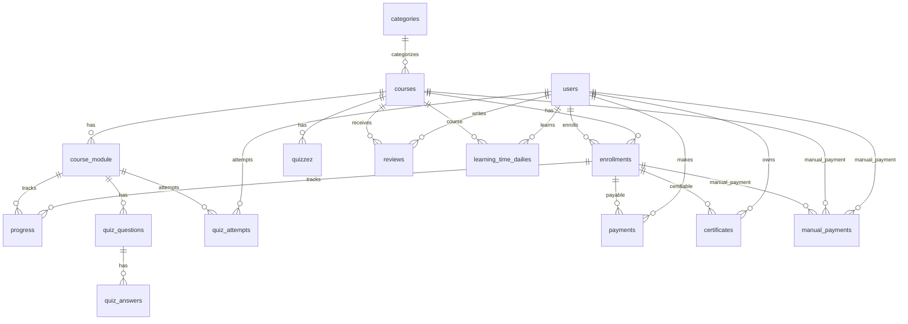

# ERD Course (tanpa atribut)

Sumber: `database/migrations` (foreign keys + relasi polymorphic via `morphs`).

## Catatan

- `payments.payable` dan `certificates.certifiable` bersifat polymorphic; untuk konteks Course ini ditampilkan ke `enrollments`.
- `course_module` adalah nama tabel modul (bukan jamak), sesuai migrations.
- `manual_payments` punya FK opsional ke `courses` dan `enrollments` (migration tambahan), jadi tetap relevan untuk flow pembayaran course manual.

## Di luar scope Course (tidak ditampilkan)

- Struktur Event (events/event_registrations/feedback/schedule/expenses/saved_events/payment_proofs).
- Notifikasi, logs, support, referral/withdrawal/broadcasts, dll.
