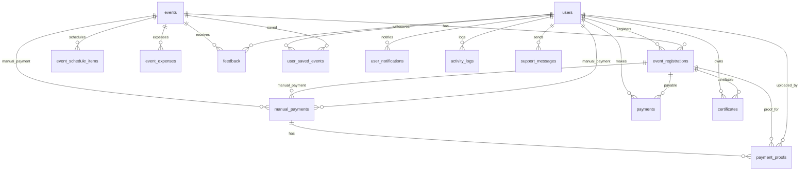

# ERD Event (tanpa atribut)

Sumber: `database/migrations` (foreign keys + relasi polymorphic via `morphs`).

## Catatan

- `payments.payable` dan `certificates.certifiable` bersifat polymorphic; untuk konteks Event ini ditampilkan ke `event_registrations`.
- `user_saved_events` dibuat tanpa FK constraints di migrations; relasi user↔event di sini bersifat “logical”.
- Kolom `event_registrations.payment_verified_by` (FK ke `users`) ada di migration tambahan; relasinya secara konsep adalah “user memverifikasi pembayaran registrasi event”.

## Di luar scope Event (tidak ditampilkan)

- Struktur Course/LMS (categories/courses/enrollments/progress/quiz/reviews).
- Referral/withdrawal/broadcasts/learning_time_dailies/profile_reminders/login_otps, dll.

## Tabel yang terdeteksi tapi definisinya bermasalah

- Migration `2025_11_25_000001_create_event_manual_incomes_table.php` kosong, jadi relasi tabel itu tidak bisa dipastikan dari migrations.
