# ERD (tanpa atribut)

Versi terpisah:

- Event: `docs/erd/erd-events-no-attributes.md`
- Course: `docs/erd/erd-courses-no-attributes.md`

Di bawah ini tetap ada versi gabungan (high-level seluruh skema).

Sumber: `database/migrations` (foreign keys + relasi polymorphic via `morphs`).

```mermaid
erDiagram
    categories ||--o{ courses : categorizes

    courses ||--o{ course_module : has
    courses ||--o{ enrollments : has
    users ||--o{ enrollments : enrolls

    enrollments ||--o{ progress : tracks
    course_module ||--o{ progress : tracks

    courses ||--o{ quizzez : has
    course_module ||--o{ quiz_questions : has
    quiz_questions ||--o{ quiz_answers : has
    users ||--o{ quiz_attempts : attempts
    course_module ||--o{ quiz_attempts : attempts

    users ||--o{ reviews : writes
    courses ||--o{ reviews : receives

    users ||--o{ payments : makes
    enrollments ||--o{ payments : payable
    event_registrations ||--o{ payments : payable

    users ||--o{ certificates : owns
    enrollments ||--o{ certificates : certifiable
    event_registrations ||--o{ certificates : certifiable

    users ||--o{ event_registrations : registers
    events ||--o{ event_registrations : has
    users ||--o{ event_registrations : verifies_payment

    events ||--o{ event_schedule_items : schedules
    events ||--o{ event_expenses : expenses

    events ||--o{ feedback : receives
    users ||--o{ feedback : writes

    users ||--o{ user_saved_events : saves
    events ||--o{ user_saved_events : saved

    events ||--o{ manual_payments : manual_payment
    event_registrations ||--o{ manual_payments : manual_payment
    users ||--o{ manual_payments : manual_payment
    courses ||--o{ manual_payments : manual_payment
    enrollments ||--o{ manual_payments : manual_payment

    manual_payments ||--o{ payment_proofs : has
    event_registrations ||--o{ payment_proofs : proof_for
    users ||--o{ payment_proofs : uploaded_by

    users ||--o{ user_notifications : notifies
    users ||--o{ profile_reminders : reminds
    users ||--o{ login_otps : has

    users ||--o{ learning_time_dailies : learns
    courses ||--o{ learning_time_dailies : course

    users ||--o{ withdrawals : withdraws

    users ||--o{ referrals : reseller
    users ||--o{ referrals : referred_user

    users ||--o{ broadcasts : sends

    users ||--o{ activity_logs : logs
    users ||--o{ support_messages : sends

    users ||--o{ sessions : session
    users ||--o{ personal_access_tokens : tokenable
```

## Catatan penting (sesuai migrations)

- `payments.payable` dan `certificates.certifiable` adalah **polymorphic** (di migrations ditulis “either Enrollment or EventRegistration”), jadi di diagram ditampilkan sebagai dua kemungkinan relasi.
- `personal_access_tokens.tokenable` juga **polymorphic** (umumnya `users`, tapi secara skema bisa model lain).
- `user_saved_events` dibuat tanpa FK constraints; relasi user↔event di sini bersifat “logical”.

## Tabel tanpa relasi FK di migrations (tetap bagian skema)

- `cache`, `jobs`
- `contents`
- `carousels`
- `dashboard_metrics`
- `password_reset_tokens`

## Tabel yang terdeteksi tapi definisinya bermasalah

- Migration `2025_11_25_000001_create_event_manual_incomes_table.php` **kosong**, jadi relasi tabel itu tidak bisa dipastikan dari migrations.
